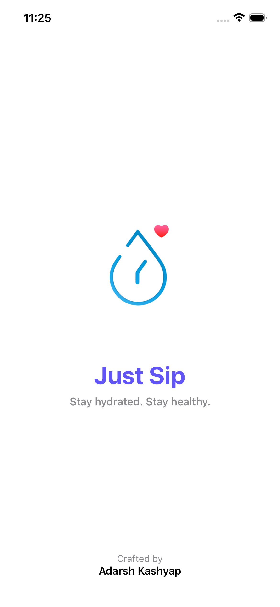
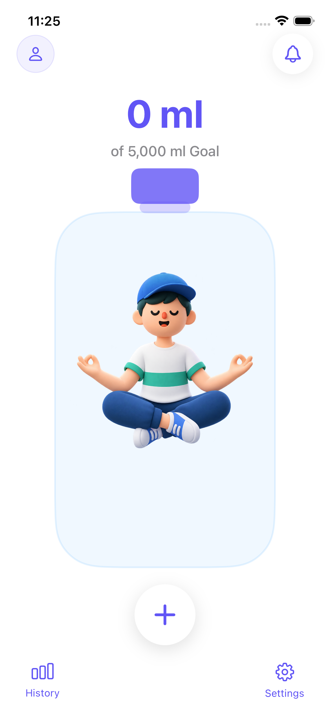
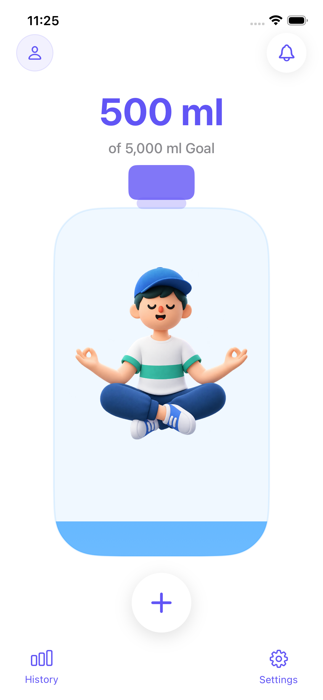
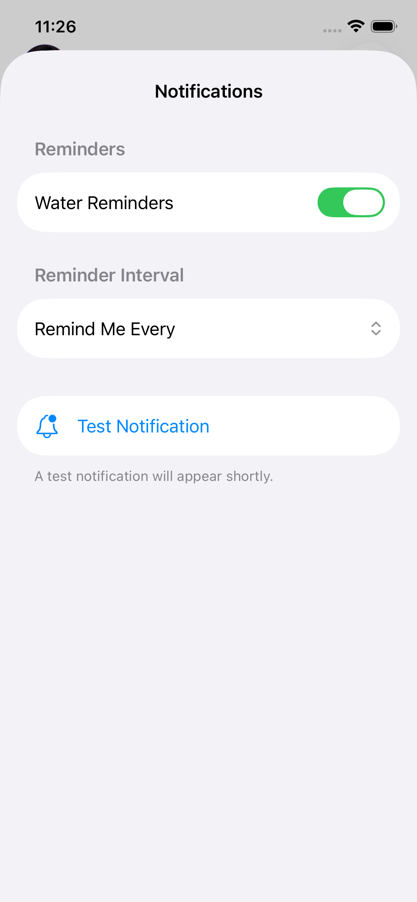
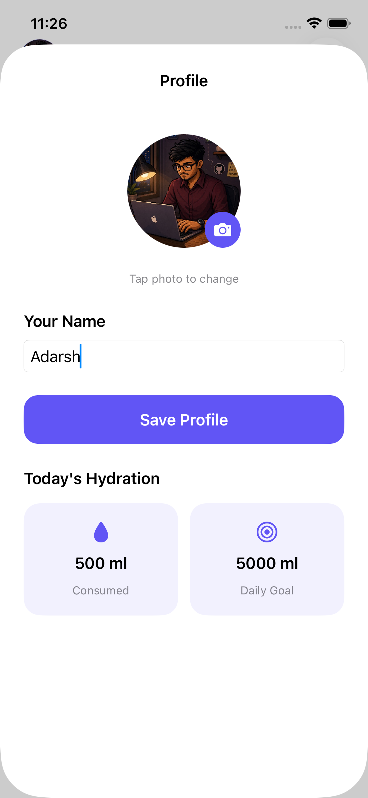
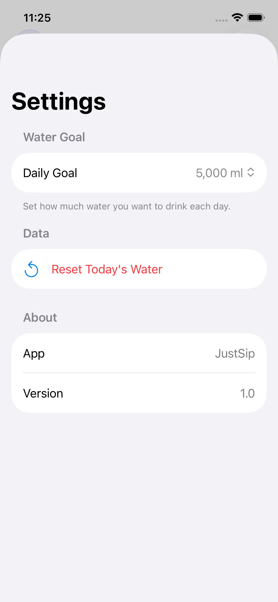

# 💧 Just Sip

<p align="center">
  <strong>A native iOS hydration tracker built with SwiftUI.</strong>
</p>

<p align="center">
  Track your water. Stay hydrated. Build a healthier habit.
</p>

<p align="center">

[](https://developer.apple.com/ios/)
[](https://www.swift.org/)
[](https://developer.apple.com/xcode/swiftui/)
[](https://developer.apple.com/xcode/swiftdata/)
[]()

</p>

---

## 🚀 Try Just Sip Online

**Don't have an iPhone or Mac? You can still try the app.**

### 👉 [🌐 Launch Just Sip in your browser](https://appetize.io/app/b_c5ijfx5vezlnju4nk4hxvxpcka)

The app is available through an interactive iOS simulator in the browser, so recruiters, developers, and visitors can explore the application without installing Xcode or owning an iPhone.

> **Note:** The browser demo runs in an iOS Simulator. Hardware-dependent features such as device-motion behavior may differ from a physical iPhone.

---

## 📱 About the Project

**Just Sip** is a native iOS hydration-tracking application created with **SwiftUI**.

The idea is simple: make daily water tracking visual, quick, and motivating.

Instead of using only a traditional progress bar, Just Sip represents hydration progress through a **custom animated water bottle** containing a character. The bottle fills as the user drinks water and can react to device movement using CoreMotion.

The project is also part of my journey of learning and building real-world iOS applications using Apple's native frameworks.

---

## ✨ Features

### 💧 Daily Water Tracking
- Track water consumed throughout the day.
- Set a personal daily hydration goal.
- View current progress directly on the Home screen.
- Quickly add predefined amounts of water.

### 🫙 Animated Water Bottle
- Custom SwiftUI bottle UI.
- Custom `WaveShape` for the water surface.
- Water level changes according to hydration progress.
- Animated hydration character.
- Custom bottle cap and styling.
- Device-motion interaction using CoreMotion.

### ➕ Quick Add
Quickly record water intake without navigating through multiple screens.

Example:

```text
Tap +
   ↓
Choose amount
   ↓
WaterViewModel
   ↓
Save entry
   ↓
Update bottle progress
```

### 🔔 Hydration Reminders
- Local notification support.
- Notification permission request.
- Custom reminder interval.
- Enable/disable reminders.
- Cancel scheduled reminders.
- Development test notification.

Powered by:

```swift
UNUserNotificationCenter
```

### 👤 Custom Profile
Users can personalize the app with:

- Their name
- Their own profile photo

The selected profile photo is also displayed on the Home screen.

### 📊 History
The History screen provides:

- Today's total water intake.
- Daily goal.
- Progress indicator.
- Individual water entries.
- Amount consumed.
- Time of each entry.

### ⚙️ Settings
Settings provides controls for:

- Daily hydration goal.
- Reminder settings.
- Reminder interval.
- Resetting today's water.
- App preferences.

### 🌙 Dark Mode
The interface supports iOS Light and Dark appearance using system-aware SwiftUI colors.

### 💦 Animated Splash Screen
A custom splash screen introduces the application with:

```text
Logo
  ↓
Scale animation
  ↓
"Just Sip"
  ↓
"Stay hydrated. Stay healthy."
  ↓
Crafted by Adarsh Kashyap
  ↓
Smooth transition to Home
```

---

# 🎨 Screenshots

## Splash Screen



## Home



## Home – Water Added



## History


## Notifications



## Profile



## Settings



---

# 🧠 How It Works

The main application flow is:

```text
                    Just_SipApp
                         │
                         ▼
                    SplashView
                         │
                         ▼
                      HomeView
              ┌──────────┼──────────┐
              │          │          │
              ▼          ▼          ▼
          Quick Add   History    Settings
              │
              ▼
       WaterViewModel
              │
              ▼
           SwiftData
```

Additional systems:

```text
CoreMotion
    │
    ▼
MotionViewModel
    │
    ▼
WaterBottleView
```

```text
UserNotifications
    │
    ▼
NotificationManager
    │
    ▼
Hydration Reminders
```

---

# 🛠️ Tech Stack

| Technology | Usage |
|---|---|
| **Swift** | Main programming language |
| **SwiftUI** | User interface |
| **SwiftData** | Local data persistence |
| **CoreMotion** | Device movement |
| **UserNotifications** | Hydration reminders |
| **Observation** | Observable application state |
| **AppStorage** | Lightweight local preferences |
| **Xcode** | Development environment |

---

# 📚 iOS Concepts Used

This project helped me practice and understand:

- Swift structs and classes
- `@State`
- `@Binding`
- `@Environment`
- `@AppStorage`
- `@Query`
- `@Observable`
- SwiftData
- `Task`
- `async/await`
- `NavigationStack`
- `.sheet`
- `.task`
- `.onAppear`
- Custom SwiftUI `Shape`
- `Animatable`
- `AnimatablePair`
- SwiftUI animations
- CoreMotion
- Local notifications
- Dark Mode
- Local persistence
- Responsive iPhone layouts

---

# 🗂️ Project Structure

```text
Just Sip
│
├── App
│   └── JustSipApp.swift
│
├── Components
│   ├── QuickAddButton.swift
│   ├── WaterBottleView.swift
│   └── WaterProgressView.swift
│
├── Models
│   └── WaterEntry.swift
│
├── View
│   ├── HistoryView.swift
│   ├── HomeView.swift
│   ├── NotificationManager.swift
│   ├── ProfileView.swift
│   ├── SettingsView.swift
│   └── SplashView.swift
│
├── ViewModels
│   ├── MotionViewModel.swift
│   └── WaterViewModel.swift
│
├── Assets.xcassets
│
└── Just Sip.xcodeproj
```

---

# 💾 Data Storage

Just Sip uses **SwiftData** for local water-entry persistence.

A typical flow is:

```text
User adds water
       ↓
WaterViewModel
       ↓
WaterEntry
       ↓
SwiftData ModelContext
       ↓
Saved locally
       ↓
HistoryView reads entries
```

The application does not require a backend server for its core hydration-tracking functionality.

---

# 📐 Hydration Progress

The bottle progress is calculated from the user's consumed water and daily goal:

```swift
progress = waterConsumed / dailyGoal
```

The value is constrained to:

```text
0...1
```

For example:

```text
500 ml / 5000 ml

= 0.10

= 10% progress
```

This progress value controls the custom water shape inside the bottle.

---

# 📱 Device Motion

The bottle uses Apple's **CoreMotion** framework.

`MotionViewModel` reads the device's attitude and exposes the roll value:

```swift
motion.attitude.roll
```

That value is passed to the custom `WaveShape` to create a more natural water movement effect.

This feature is best experienced on a physical iPhone.

---

# 🔔 Notification Flow

```text
User enables reminders
        ↓
Request notification permission
        ↓
Permission granted
        ↓
Select reminder interval
        ↓
Schedule local notification
        ↓
iPhone displays reminder
```

Example notification:

> 💧 Time for a sip

> Stay hydrated and keep your Just Sip goal on track.

---

# 🎯 Roadmap

### Next Features

- 📅 Weekly hydration overview
- 🎯 Goal completion indicator
  - 🎉 Completed
  - 💧 In Progress
  - ❌ Missed
- 📈 Weekly hydration charts
- 🏆 Hydration streaks
- 🔔 Smarter reminder scheduling
- 📱 Home Screen Widget
- 🎯 Personalized hydration recommendations
- ☁️ Optional iCloud synchronization
- ⚡ Further performance optimization
- ✨ More advanced bottle animations

---

# 🧪 Current Status

🚧 **Actively developing**

Current focus:

- Weekly analytics
- Goal completion states
- UI polish
- Notification experience
- Performance optimization
- Dark Mode refinement

---

# 🎯 Why I Built Just Sip

Just Sip started as a simple idea for tracking daily water intake.

While building it, the project became a way to learn how multiple native iOS technologies work together in a real application:

```text
Swift
  +
SwiftUI
  +
SwiftData
  +
CoreMotion
  +
UserNotifications
  +
Animations
  +
Local Persistence
```

The goal is not just to build another CRUD application, but to understand how to create a polished, interactive, native iOS experience.

---

# 👨‍💻 Developer

### Adarsh Kashyap

B.Tech CSE Student | iOS Developer

Building and learning native iOS development with Swift and SwiftUI.

---

## ⭐ Support

If you find the project interesting, consider giving the repository a ⭐.

**Thanks for checking out Just Sip! 💧**
